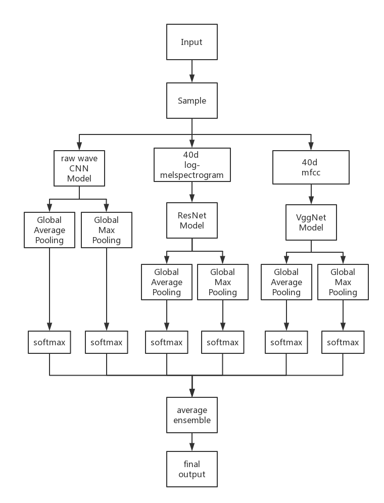

# tensorflow-speech-recoginition-challenge
This is my code for the kaggle competition: [Tensorflow Speech Recoginition Challenge](https://www.kaggle.com/c/tensorflow-speech-recognition-challenge). All the models are implemented by Pytorch. Special thanks to the competition's champion [Heng CherKeng](https://www.kaggle.com/hengck23). My work is based on his posts.

### Architecture

### Result
> 116/1315 (Top 9%)

All the training/valid details are in the log files.
